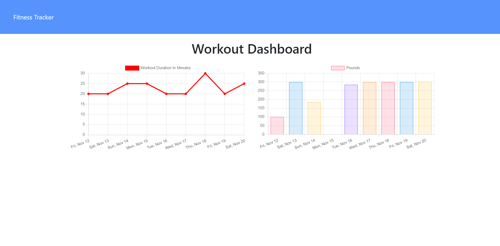

# Fitness Tracker

## Description

A high accessibility daily fitness tracker. Log all of your workouts for the day to help you keep up with your fitness goals and achieve your ideal physical wellness.

Fitness Tracker also allows you to see the daily metrics hit by past workouts so you can see your general activity level.

## Usage

To start logging a new work out simply follow these steps.

1. Click New Workout
2. Choose between cardio and resistance from the drop down
3. Fill in all fields for the exercise you wish to log.
4. If you wish to log another exercise click Add Exercise
5. If you have no more exercise to log click the complete button to return to the home page.

Clicking the Dashboard button in the nav bar will take you to a chart of your totals for the past seven exercises.

Find me on Github

https://github.com/andrewroddy92
